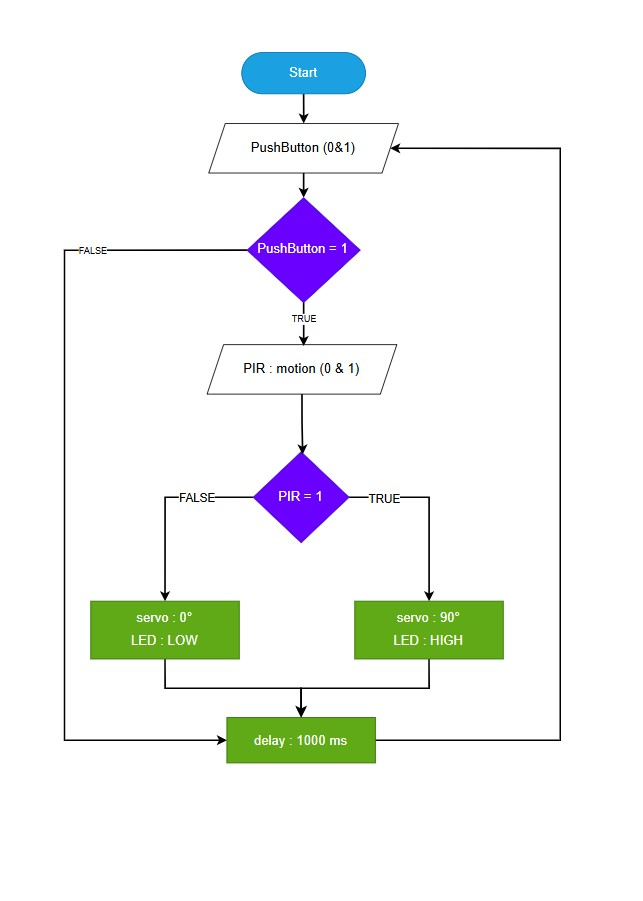
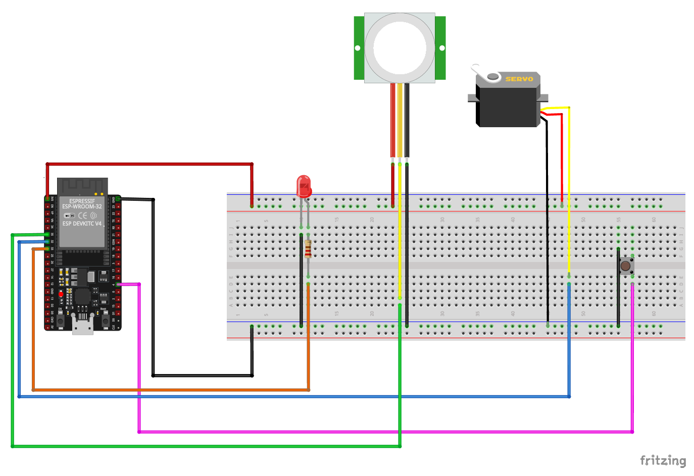

# HappyPet IoT Project

## 📌 โครงการ IoT สำหรับดูแลสัตว์เลี้ยง

**HappyPet** เป็นโครงการ IoT ที่พัฒนาขึ้นในระดับมหาวิทยาลัย โดยใช้เทคโนโลยีต่าง ๆ เช่น ภาษา C, Node-RED และ Blynk เพื่อสร้างระบบที่ช่วยให้เจ้าของสัตว์เลี้ยงสามารถดูแลและติดตามสุขภาพของสัตว์เลี้ยงได้อย่างมีประสิทธิภาพ

---

## 🛠 เทคโนโลยีที่ใช้

- **ภาษา C++**: ใช้สำหรับพัฒนาโปรแกรมที่ทำงานบนไมโครคอนโทรลเลอร์
- **Node-RED**: ใช้สำหรับการออกแบบและควบคุมการทำงานของระบบ IoT
- **Blynk**: ใช้สำหรับสร้างแอปพลิเคชันมือถือที่เชื่อมต่อกับระบบ IoT

---

## 📁 โครงสร้างของโปรเจกต์

```
HappyPet
├── ITDS282_GR11_Project_Code.ino
├── ITDS282_GR11_Project_FlowChart.jpg
├── ITDS282_GR11_Project_Fritzing.png
├── ITDS282_GR11_Project_NodeREDFlow.json
└── ITDS282_GR11_Project_Report.pdf
```

---

## 🔍 แผนผังและภาพประกอบ

### 1. Flowchart ระบบ


ระบบทำงานโดยการประมวลผลข้อมูลและควบคุมตามขั้นตอนใน Flowchart นี้

---

### 2. แผนผังการต่อวงจร (Fritzing)


ภาพนี้แสดงการเชื่อมต่อฮาร์ดแวร์ทั้งหมดในโปรเจกต์

---

## 🚀 วิธีการติดตั้งและใช้งาน

1. เปิดไฟล์ `ITDS282_GR11_Project_Code.ino` ใน Arduino IDE แล้วอัปโหลดไปยังไมโครคอนโทรลเลอร์
2. เปิด Node-RED แล้วนำเข้าไฟล์ `ITDS282_GR11_Project_NodeREDFlow.json` เพื่อกำหนดการทำงานของระบบ
3. สร้างโปรเจกต์ในแอป Blynk และเชื่อมต่อกับระบบตามที่กำหนดไว้

---

## 📄 รายงานโครงการ

รายละเอียดเพิ่มเติมดูได้ในไฟล์ [ITDS282_GR11_Project_Report.pdf](./ITDS282_GR11_Project_Report.pdf)

---

## 📢 หมายเหตุ

- โปรเจกต์นี้เป็นส่วนหนึ่งของการเรียนการสอนในสาขาเทคโนโลยีสารสนเทศ  
- ระบบสามารถปรับแต่งและพัฒนาต่อได้ตามความต้องการ

---

## 📬 ติดต่อ

ติดต่อผ่าน GitHub: [https://github.com/kkkkhxx/HappyPet](https://github.com/kkkkhxx/HappyPet)  
หรืออีเมล: tanyaratclub@gmail.com
